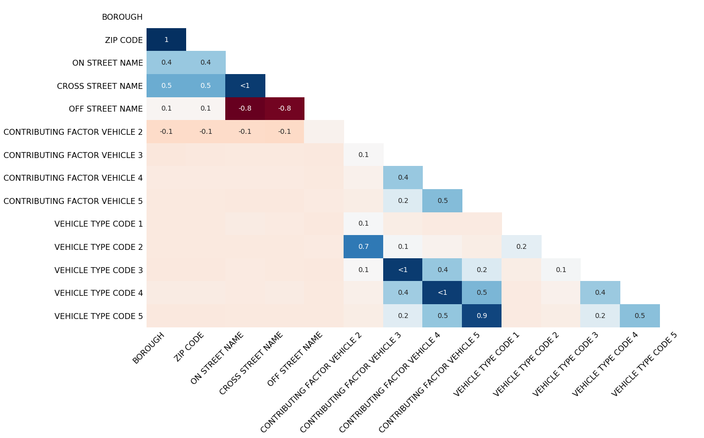

# Missingno
Missingno creates chars for visualizing missing data. As you can see in the following example, it's pretty simple.

Barchart displays NaN values by each column:
```
import missingno as msno
# if you set "log=True", then the barplot will have a log scale
msno.bar(df)
```


Matrix displays missing values like they are in the actual dataframe.
The less missing values in a column (except 0 missing values) the higher the chances, that the missing values are random.
This is only a rule of thumb, but often it hints you in the right direction, where the missing values came from.
```
msno.matrix(df.sample(250))
```


If you are working with time-series data, you can add timestamps to your Matrix and show missing values according to them.
```
null_pattern = (np.random.random(1000).reshape((50, 20)) > 0.5).astype(bool)
null_pattern = pd.DataFrame(null_pattern).replace({False: None})

msno.matrix(null_pattern.set_index(pd.period_range('1/1/2011', '2/1/2015', freq='M')) , freq='BQ')
```


The heatmap measures nullity correlation: shows if there is a correlation, between columns when a missing value is in a 
specific column.
```
msno.heatmap(df)
```


Dendrogram shows in more detail, if there is a correlation between missing values.
The numbers on the y-axis show, how man values weren't in correlation, so the higher the number the less correlation there is.
```
msno.dendrogram(df)
```


## References
Bilogur, (2018). Missingno: a missing data visualization suite. Journal of Open Source Software, 3(22), 547,\
https://doi.org/10.21105/joss.00547