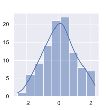

# Statistics Fundamentals
https://latex.codecogs.com/

## Statistical distribution
Statistical distribution show us the probability, that a measurement has a specific value.
the highest parts of a distribution show which values are most likely.

There are different kinds of distribution:

### Histograms
A Histogram displays the frequency with what an value is represented in an dataset.
Because exact same values are rare, values are separated in specific bins and the amount of values in that bin shows how 
high the bar in the Histogram is.

The following distributions are all functions, that describe data like a histogram.
This helps us work with data more mathematically and accurately, smooths out some inconsistencies and is independent of the amount of bins we use.
In fact the function in the image above is a normal distribution, more on that later.

### Sampling A Distribution
Sampling a distribution means to generate random values from a distribution (for example normal Distribution) and compare
the histogram of the generated values to the histogram of the real world data. if it fits, then the distribution resembles
the real world.

#### Normal distribution
Normal distribution is a bell-shaped curve.

#### The Central Limit Theorem
This theorem describes, that as long as here is no direct influence on the variance, **the a collection of any distribution's means will
be normally distributed** (histogram will have a bell shape)
This means, we don't need to care about the original distribution of the data, we can calculate a bunch of means (at least 30)
and work with the normal distribution instead.

