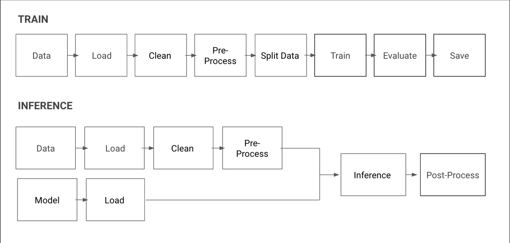

# Create a plan

It's easier to improve than to invent!

This is the reason, we should try to build a working pipeline as quickly as possible.
To do that 
* Use similar data (only needs to have similar input types)
* Read other people model implementations (and try to replicate their results)
* Implement training pipeline with simplest model (Often Heuristics and should only evaluate and save model)
* Implement inference pipeline with the trained model (is the pipeline, that produces the results)

## Business Performance
We must differentiate between a good model metric and a good product metric.
* Model metric shows models performance on the dataset
* product metric represent how good your whole product is performing

In the end only the product metric matters, that means often improving other parts of the product might yield a higher 
increase in performance than simply trying to improve the model.

## Model metric
There are different ways to track your models performance, each error function has it's advantages and disadvantages, 
here are some commonly used:
* Cross-entropy
* BLEU Score (better measurement of similarity between text)

## Freshness and Distribution Shift
Supervised models are trained on collected data, but when the data shifts, the model itself must be retrained as well.
This is called Freshness, the more accurate the fresher the model.

When implementing models in production the following is very important to consider:
* How hard is it to collect the data?
* How long is the model staying fresh?
* how long does it take to retrain the model?

If you have traffic on your ml service, you can use your users to collect data about your models accuracy!!!

## Speed
To estimate how fast you algorithm need to perform it's task, you need to look at your use case.
If you are translating inside a text-editor it needs to be faster than a second, but if you want to forecast the weather for 
tomorrow, you have a whole day.

## Estimate Scope and Challenges

### Leverage Domain Expertise
To create an heuristic model we first need to get knowledge about the field we are developing the model for.

To do this there are 2 ways
* Learn from experts (ask people that know that field very well)
* Examining the data
    * Exploratory data analysis (EDA) is data visualization (gives you an understanding of the data)
    * individually label examples in the way you want your model to do so (generates heuristic rules automatically)
* see how others have solved this problem

## Stand on the shoulders of giants
* Look for other open source projects that have soled a similar problem or worked with a similar dataset
* The easiest way is to reproduce the results from other (rerun other projects)
* this acts as a prove of concept, to show investors how it could work

### Open data
Often you don't find data, that fits your need perfectly, but there are definitely dataset, that are similar to the data
you need.
Best websites for datasets:
* https://archive.org/details/datasets
* https://reddit.com/r/datasets
* https://www.kaggle.com/datasets
* https://archive.ics.uci.edu/ml/index.php
* https://datasetsearch.research.google.com/
* https://commoncrawl.org/
* https://en.wikipedia.org/wiki/List_of_datasets_for_machine-learning_research

Some dataset are so similar (have the same inputs), that you could try to train the model on the downloaded dataset and apply the
model to the gathered data.

### Open source code

Seeing other peoples work can help us see
* which challenges the others have faced
* surfaces potential issues with the dataset

If you don't find code that is similar to your project, abstract your problem!
When you have found a good codebase, try to replicate their results (sometimes it doesn't work)

1. Find a similar open source model, ideally paired with a dataset it was trained on,
and attempt to reproduce the training results yourself.
2. Once you have reproduced the results, find a dataset that is closer to your use
case, and attempt to train the previous model on that dataset.
3. Once you have integrated the dataset to the training code, it is time to judge how
your model is doing using the metrics you defined and start iterating.

## ML Editor Planning

1. Find a similar dataset that is easy to get
2. Choose a simple model (often Heuristic)
! THE FASTER YOUR MODEL FAILS; THE MORE PROGRESS YOU WILL MAKE!
3. Start your model training with weak labels (weak labels mean, that it is only slightly correlated with the desired output)
    
## Start a Pipeline
There are 2 Pipelines we need for each ML Project,
* The training pipeline (Often Heuristics and should only evaluate and save model)
    *Load records of data.
    *Clean data by removing incomplete records and input missing values when
    necessary.
    *Preprocess and format data in a way that can be understood by a model.
    *Remove a set of data that will not be trained on but used to validate model results
    (a validation set).
    *Train a model on a given subset of data and return a trained model and summary
    statistics
* The Inference pipeline (is the pipeline, that produces the results)
    *Load a trained model and keep it in memory (to provide faster results)
    *Will preprocess (same as training)
    *Gather any relevant outside information
    *Will pass one example through a model (an inference function)
    *Will postprocess, to clean up results before serving them to users

