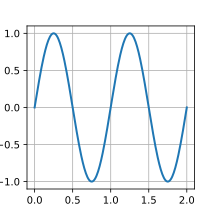
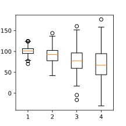

# Matplotlib
In matplotlib every plot is in a container or grid, these are called **figures**. Plots in figures are stored in **axis**,
these can be customized, changed in size and in location in the figure. **Ticks** are the steps on the x-axis/ y-axis, the
x-axis/y-axis is called **spine**, to differentiate better.

## How to work with Matplotlib
Generally the workflow follows this pattern:
1. We need to define a figure, which is the container of any of your plots
    ```
    fig = plt.figure(figsize=(3,3))
    ```
2. Then we can add Axes/ subplots, which hold the actual plots 
    ```
    plt.subplot(2, 1, 1)
    plt.plot(X,Y)
    ```
3. Additionally we can add some configurations to the plot and axis
    ```
    plt.xlim(-1.5, 1.5)
    plt.ylim(-1.5, 1.5)
    ```
4. Show / save the plot
    ```
    fig.savefig("../img/img.svg")
    plt.show()
    ```
5. Clear plot (necessary when reusing the )
    ```
    # clear axis
    fig.cla()
    # clear figure
    fig.clf()
    ```

Now Matplotlib offers shortcuts to speed up the process:

**Define figure and axis at once:**
```
fig, ax = plt.subplots(figsize=(3,3))
ax.plot(X, Y, lw=2)
plt.show()
```

**Shortest method:**
```
df.plot(kind="scatter", x=x_values, y=y_values)
plt.show()
```

## How to create multi-plot layouts
#### Horizontal
```
# create figure
plt.figure(figsize=(6, 3))
# add subplot
plt.subplot(1, 2, 1)
plt.text(0.5, 0.5, 'subplot(1,2,1)', ha='center', va='center')

plt.subplot(1, 2, 2))
plt.text(0.5, 0.5, 'subplot(1,2,2)', ha='center', va='center')
```

#### Vertical
```
# create figure
plt.figure(figsize=(3, 6))
# add subplot
plt.subplot(2, 1, 1)
plt.text(0.5, 0.5, 'subplot(2,1,1)', ha='center', va='center')

plt.subplot(2, 1, 2)
plt.text(0.5, 0.5, 'subplot(2,1,2)', ha='center', va='center')
```
 
#### Advanced
The subplot function works like this, subplot(nrows, ncols, index). every plot needs at least 2 rows to be displayed
```
fig = plt.figure()
#  subplot(nrows, ncols, index), define rows, columns of grid and where it is
plt.subplot(4, 1, 1)

plt.subplot(4, 1, 2)

plt.subplot(2, 3, 4)

plt.subplot(2, 3, 5)

plt.subplot(2, 3, 6)

```

 
## Different plots and elements in matplotlib
| Img  |  Kind (and Parameters) | Description  |
|---|---|---|
|  | plot() <br><br> \[X], **Y**,, label, fmt, color, marker, linestyle | Used for change over time |
|  | scatter() <br><br> **X**, **Y**, s(izes), c(olors), markers, cmap| Best to compare two features |
|  | bar\[h]() <br><br> **x**, **height**, width, bottom, align, color | barh rotates the plot |
|  | hist <br><br>  **X**, bins, range, density, weights | Used to see value distribution |
|  | boxplot() <br><br> **X**, notch, sym, bootstrap, widths  | Boxplot shows outliers better |
|  | violinplot() <br><br> **X**, **Y**, fmt, color, marker, where | An alternative to Boxplot |
|  | contour\[f]() <br><br> \[X], \[Y], **Z**, levels, colors, extent, origin | Visualizes values in an 2d array |
|  | hexbin() <br><br> **X**, **Y**, C, gridsize, bins  | Like a scatter plot, but hexagonals are buckets for values |
|  | step() <br><br> **X**, **Y**, \[fmt], color, marker, where | Different format of plot() with no transition |
|  | errorbar() <br><br> **X**, **Y**, xerr, yerr, fmt  | Adds error bars to plot(), <br>to show how accurate values are |
|  | barbs() <br><br> \[X], \[Y], **U**, **V**, C, length, pivot, sizes | It's used to plot any two dimensional vector quantity |
|  | eventplot() <br><br> **positions**, orientation, lineoffsets | t's useful where you need to show <br> timing or position of multiple sets of discrete events. |
|  | xcorr() <br><br> **X**, **Y**, normed, detrend | Plots the cross correlation between x and y |
|  | imshow() <br><br> **Z**, \[cmap], interpolation, extent, origin | Displays images, or values of an 2d array |
|  | plot_surface() <br><br> **X, Y, Z** (2d arrays) <br><br> color, cmap, shade| Best to compare two features |
|  | pie() <br><br>  **Z**, \[explode], labels, colors, radius  | Creates a piechart |
|  | text() <br><br> **x**, **y**, **text**, va, ha, size, weight | Adds text to plot at specific coordinates |
|  | quiver() <br><br> \[X], \[Y], **U**, **V**, C, units, angles | Adds arrows |
|  | fill\[_between]\[x]() <br><br> **X**, Y1, Y2, color, where | fills area between values |

##### Implementations are found [here](./code/matplotlib.ipynb) 

## Most important customizations
First let's have a deeper look into the anatomy of a figure:

As you can see, there are a lot of different parts at play to build a graph. We will only focus the most important ones:
```
# Set Title
plt.title("My Title")

# Change label of axis
plt.ylabel("My Y Label") ; plt.xlabel("My X Label")

# Change the axis values (ticks)
plt.yticks(range(1,10)) ; plt.xticks([0,2,4,6,8],
                            ['0', '2B', '4B', '6B', '8B'])

# Change range of an Axis (first 2 values are min and max for x-axis, last 2 for y-axis)
plt.axis([-5, 105, 0, 5])

# add/ customize legend
plt.legend(loc=9)
```


#### Next up [Seaborn](./Seaborn.md)

## References
* https://matplotlib.org/
* http://scipy-lectures.org/intro/matplotlib/auto_examples/
* https://github.com/matplotlib/cheatsheets