# Seaborn
Seaborn is a visualization library which is based on matplotlib, but it creates more appealing graphs with
less code. In addition it works really well with Pandas.
To accomplish this, Seaborns predefined graphs doesn't have the same flexibility as matplotlib graphs, but 
you can use matplotlib methods to configure an Seaborn graphs.

## How to work with Seaborn
Setting up a seaborn graph is quite simple in comparison to matplotlib:
````
import seaborn as sns

sns.distplot(df['column'], kde=False, bins=25)
````

### Different Seaborn plots:

#### Distribution Plots
| Img  |  Kind (and Parameters) | Description  |
|---|---|---|
| 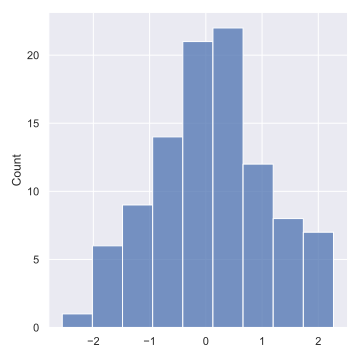 | displot() <br><br>, **x**, **y**, data, kind ("hist", "kde", "ecdf"), hue, rug | Plot univariate or bivariate histograms to show distributions of datasets |
| 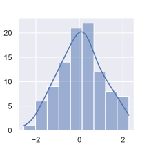 | histplot() <br><br>, **x**, **y**, data, stat (“count”, “frequency”, “density”, “probability”), bins, kde| Alternative to the deprecated distplot, <br> Plot univariate or bivariate histograms to show distributions of datasets |
| 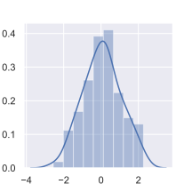 | distplot() <br><br> **\[a]**, kde, bins, hist, rug, fit, vertical, label | Shows the distribution. (Will be **deprecated**, use displot(), histplot() instead) |
| 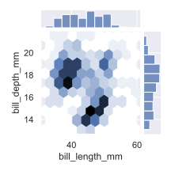 | jointplot() <br><br>  **x**, **y**, data, kind ( “scatter”, “kde”, “hist”, “hex”, “reg”, “resid” ), dropna | Compares two distributions. plots scatter plot on default |
| 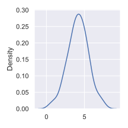 | kdeplot() <br><br> **\[x]**, \[y], data, fill, bw | A kernel density estimate (KDE) plot |
| 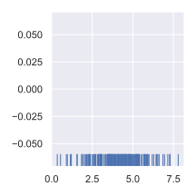 | rugplot() <br><br> **\[a]**, data, x,y, legend, axis (“x”, “y”) | Plot marginal distributions by drawing ticks along the x and y axes |

Simple way to plot correlations between columns:

| Img  |  Kind (and Parameters) | Description  |
|---|---|---|
| 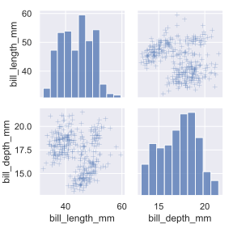 | pairplot() <br><br> **data**, vars, kind ('scatter’, ‘kde’, ‘hist’, ‘reg’), diag_kind (‘auto’, ‘hist’, ‘kde’, None) | Plot pairwise relationships in a dataset |

#### Categorical Plots 

| Img  |  Kind (and Parameters) | Description  |
|---|---|---|
| 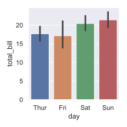 | barplot() <br><br> **data**, **x**, **y**, hue, estimator, order, orient ('v', 'h'), color, palette, saturation | Shows distribution of categorical data. Hue can hold additional categorical data |
| 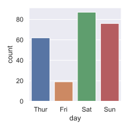 | countplot() <br><br> **data**, **x**, y, order, orient, doge | Shows distribution though counting values |
| 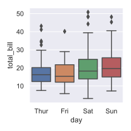 | boxplot() <br><br> **data**, **x**, **y**, hue, fliersize | Displays a Boxplot |
| 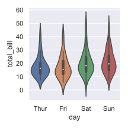 | violinplot() <br><br>  **data**, **x**, **y**, hue, split, scale | Draw a combination of boxplot and kernel density estimate |
| 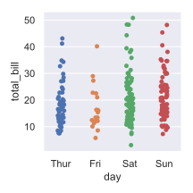 | stripplot() <br><br> **data**, **x**, **y**, hue, jitter, edgecolor, linewidth | Draw a scatter plot where one variable is categorical |
| 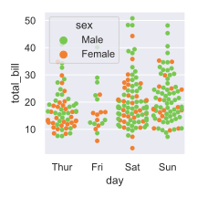 | swarmplot() <br><br> **data**, **x**, **y**, hue, color, size | Like a strip plot, without overlapping points |

#### Scatter Plots
* Regression Plots: 
    ```
    sns.lmplot(x='col1', y='col2', data=df, col='col3', hue='col4',
              height=8, aspect=0.6)
  
    # important parameters: x, y, data, col, hue, row, markers, legend, x_estimator, x_bins, fit_reg, ...
    ```
    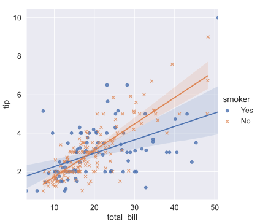

* Scatter:
    ```
    sns.relplot(data=tips, x="total_bill", y="tip", hue="day")
    # important parameters: x, y, data, col, hue, row, size, markers, legend (auto”, “brief”, “full”, or False), ...
    ```
    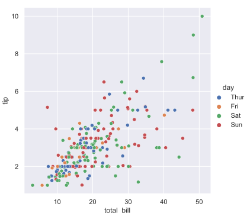

* Pair Grid: Subplot grid for plotting pairwise relationships in a dataset
    ```
    g = sns.PairGrid(df)
    g.map(sns.scatterplot)
  
    # more customization
    df.map_offdiag(plt.scatter)
    df.map_diag(plt.hist)
  
    g.map_upper(sns.scatterplot)
    g.map_lower(sns.kdeplot)
    g.map_diag(sns.kdeplot)
    
    g.add_legend()
    ```
    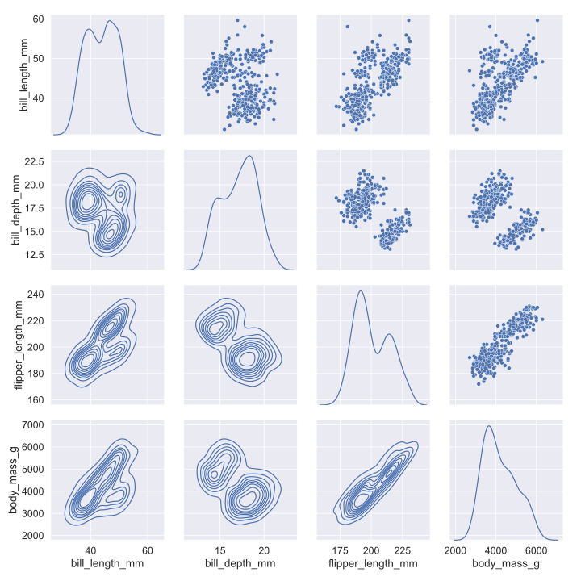

* Facet Grid: Multi-plot grid for plotting conditional relationships
    ```
    g = sns.FacetGrid(df, col="col1", row="col2", hue="col5")
    g.map(sns.scatterplot, "col3", "col4")
    ```
    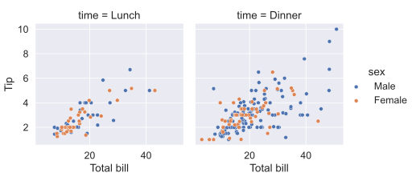
#### Matrix Plots

Dataframes must be "pivoted", before it's useable in a heatmap:
```
df_mx = df.corr()

# create own correlation table with specific values
df = df.pivot_table(index='column1', columns='column2', values='column3')
```
| Img  |  Kind (and Parameters) | Description  |
|---|---|---|
| 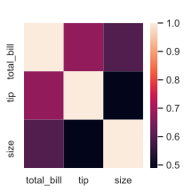 | heatmap() <br><br> **data** (2D dataset), vmin, vmax, cmap, center, robust, annot, cbar | Plot rectangular data as a color-encoded matrix |
| 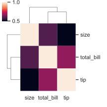 | clustermap() <br><br> **data**, pivot_kws, method, z_score standard_scale | Plot a matrix dataset as a hierarchically-clustered heatmap |

### Customize Seaborn plots:
Often Seaborn doesn't provide own styling methods. If that is the case than use the matplotlib styling methods. 
```
# different styles are: white, dartkgrid, whitegrid, dark,ticks
sns.set_style('white')

# Change appearance of plot for different purposes: (paper, talk, poster)
sns.set_context('paper', font_scale=1.4)

# remove spines (Axis lines)
sns.despine(top=False, right=False)
```

There are 2 reasons to create visualizations:
* To explore data
* To communicate data

Matplotlib and Seaborn can be sorted in the first category, because with them you can build visualizations quickly, but 
they lack production quality features (interactivity, more appealing design, Website ready).
There are many libraries, that fit the second reason very well, for example Plotly, Brokeh or Altair, but we will be focusing
on Plotly in this summary

#### Next up [plotly](./Plotly.md)

### References
* https://seaborn.pydata.org/index.html
* https://www.kaggle.com/kanncaa1/seaborn-tutorial-for-beginners
* https://github.com/derekbanas/seaborn/blob/master/SB%20Tut.ipynb
