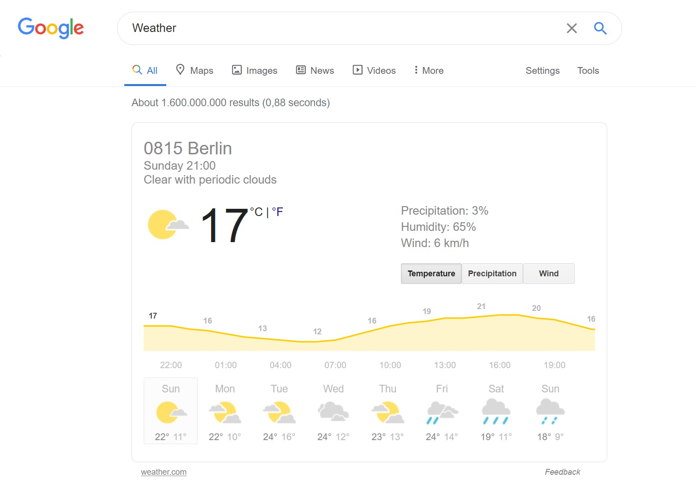

# Beautiful soup

Beautiful soup is the most beginner friendly web scraper, but very limited.
That's because it isn't a real web scraper, it's a module for pulling data out of HTML and XML file.
The problem with Beautiful soup is, that it doesn't work on it's own. For this reason additional libraries
are needed along side Beautiful soup:
**Request** or urlib 2 as libraries for fetching the HTML and XML files from websites for APIs.
Additionally to parse the files, **lxml's XML parser**, **lsml's HTML parser**, **HTML5lib** or **html.parser** could be used.
Advantages of Beautiful soup are:

1. Easy to understand and perfect for simple tasks where speed isn't that necessary
2. It's well documented and has a good community

## Example: Weather status
To demonstrate a simple Beautiful soup project we want to got the Weather from Google. 
At first we need to inspect the website we want to fetch the data from. 
**https://www.google.com/search?q=Weather** will lead you to the following website:



When pressing ctr + shift + i, in the browser, the inspector wil open and it's possible to see the HTML code of the
website. If you need more information about basic HTML manipulation, there is plenty resources online to choose from.
```
<span class="wob_t" id="wob_tm" style="display:inline">17</span>
```
This is the HTML element of the temperature, as type **span**, an special id, a class and some additional styling and 
the actual value (17). With all that information we can later specify what Beautiful soup should look for.
Now to the actual code, firstly we need to import the request library to fetch the website than the beautiful soup library
and the xml library to parse the HTML code.\
Next we want to get the HTML file. For this we need to specify, with what type of browser the Request library should access
the website (Specified as "USER_AGENT"), this must be saved in the header of the request.

```
import requests
from bs4 import BeautifulSoup
import lxml

USER_AGENT = "Mozilla /5.0 ( Macintosh ; Intel Mac OS X 10.14; rv :65.0) Gecko /20100101 Firefox /65.0 "

headers = {"user-agent": USER_AGENT}

url = "https://www.google.com/search?q=Weather"
result = requests.get(url, headers=headers)
```
To operate on the HTML file we need to create a Beautiful soup object with a specific parser. This soup object can now 
be used to find different elements which have the attributes with the soup.find_all() method.
```
soup = BeautifulSoup(result.content, "lxml")

temperature = soup.find_all("span", {"id": "wob_tm"})
precipitation = soup.find_all("span", {"id": "wob_pp"})
humidity = soup.find_all("span", {"id": "wob_hm"})

print ("Temperature: ", temperature [0]. getText () , 
        "\nPrecipitation: ", precipitation [0]. getText () ,
        "\nHumidity: ", humidity [0]. getText () )
```

The output could look like this:
```
Temperature: 16
Precipitation: 3%
Humidity: 68%
```
This is pretty much how bs4 (Beautiful soup) works.

#### Next up: [Selenium](Selenium.md)
