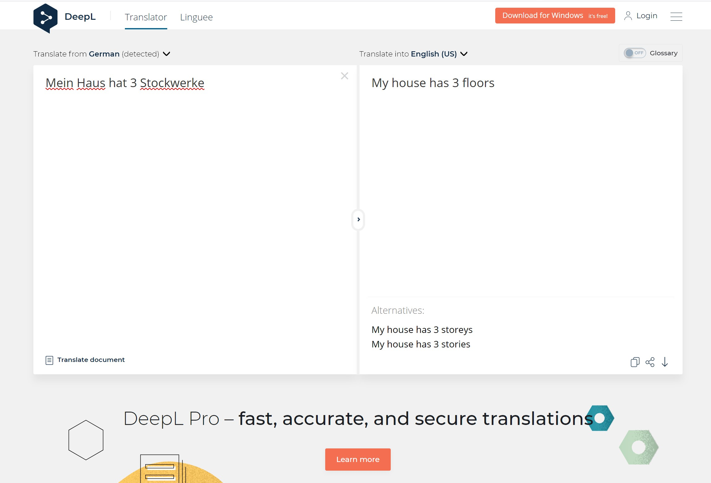

# Selenium
Selenium isn't designed to be a web scraper either, it was developed to automate tests for web-applications.
That means, it's easy to set up and interact with any kind of websites and their implemented Javascript, but
it's slow if you perform many scrapes and it isn't very resource efficient.
Advantages of Selenium:

1. Easy interaction with Javascript and navigation on websites in general
2. Supports XPath for finding an element in the DOM
3. Qucik to set up

To use Selenium you first need to download a browser driver, this program builds the connection
between the browser installed on your machine and the Selenium library. If you have Chrome installed you need the 
[Chrome driver](https://chromedriver.chromium.org/), with that you can set an environment variable to the Chrome driver or you
can give a link to the driver when initializing the driver:
```
driver = webdriver.Chrome(executable_path=r'your\path\chromedriver.exe')
```
## XPath
XPath was mentioned earlier, but not explained, so what is it?\
It is a query language for selecting XML\HTML elements. It's preferred over selecting by id or classes, because it can 
be much more precise and is a lot cleaner to read. To build an XPath query there are the following **expressions**:

| expression | description |
|------------|-------------|
| nodename | Select all nodes with the name "nodename" |
| / | Selection starts from the root node |
| // | Selection starts from the current node that matches the selection |
| . | Selects current node |
| .. | Selects parent of current node |
| @ | Selects attributes |
| box/bottle | Selects all bottles in boxes|
| //bottle | Selects all bottles in the file |
| //bottle[1] | Selects the first bottle |
| //bottle[@class="wine"] | Selects all bottles with the class wine |

These are not all expressions XPath is able to perform. If you want to dive deeper into XPath, you can learn 
[here](https://www.w3schools.com/xml/xpath_intro.asp) more

## Example: Weather status
To compare the different work flows of these libraries, let's build the same weather scraper with Selenium.
Again we need to import the Selenium library, then we need to initialize the driver object, either with a path to the
driver file or if no parameter is passed, then Selenium will check for an environment variable of that driver.
```
from selenium import webdriver

driver = webdriver.Chrome(executable_path=r'your\path\chromedriver.exe')
driver.get("https://www.google.com/search?q=Weather")
```

Selenium provides a bit more flexibility when it comes to searching for elements in an HTML file.
It provides the standard methods of finding elements by name/class/id but you can provide an XPath as well.
To get the XPath of an element simply select XPath. If you have performed all operations on the website you have to close 
driver again, otherwise you will end up with a not terminated process.
```
temperature = driver.find_element_by_id("wob_tm")
precipitation = driver.find_element_by_xpath('//*[@id="wob_pp"]')
humidity = driver.find_element_by_xpath('//*[@id="wob_hm"]')

print("Temperature: ", temperature.text, "\nPrecipitation: ", 
        precipitation.text, "\nHumidity: ", humidity.text)

driver.quit()
```
The output could look like this:
```
Temperature: 16
Precipitation: 3%
Humidity: 68%
```

## Example: Translation
To show the real strength of Selenium we are going to use www.deepl.com to translate everything we want to English.\
First we need to initialize the chrome driver again and load the website.


```
import time
from selenium import webdriver
from selenium.webdriver.common.by import By
from selenium.webdriver.support.wait import WebDriverWait
from selenium.webdriver.support import expected_conditions as EC

text = input("To translate: ")

# change Chrome browser language to english
options = webdriver.ChromeOptions()
options.add_argument("--lang=en-GB")

driver = webdriver.Chrome(executable_path=r'C:\Program Files (x86)\Chromedriver\chromedriver.exe', options=options)
driver.get("https://www.deepl.com/en/translator")


```
To click on a certain element, you can use the click() method. To insert text into an element use the
send_keys() method.
```
transInput = driver.find_element_by_xpath('//*[@id="dl_translator"]/div[2]/div[3]/div[2]/div/textarea')
transInput.click()
transInput.send_keys(text)

```
Selenium often needs to wait until the JavaScript has been loaded or can be executed correctly.
The easy way would be to use the **sleep** method of the time library. The problem is, often it's unclear how long the
website takes to load. For this reason the example uses an better method:\
**WebDriverWait** is a method to stop the web-driver until some **expected_conditions** happen.
There are many predefined expected conditions, and it's even possible to create custom ones as well.
```
try:
    loadTrans = WebDriverWait(driver, 5).until(
        EC.element_to_be_clickable((By.XPATH, '/html/body/div[2]/div[1]/div[2]/div[4]/div[3]/div[1]/textarea')))
    loadTrans.click()
finally:
    time.sleep(8)
    transOutput = driver.find_element_by_xpath('/html/body/div[2]/div[1]/div[2]/div[4]/div[3]/div[2]/p[2]/button[1]')

    print("Translation of: ", text, "\nis: ", transOutput.text)
    driver.quit()
```
The output could look like this:
```
Translation of: Mein Haus hat 3 Stockwerke
is: My house has 3 stories 
```
Selenium has a lot more features that I could cover here, but to keep the summary simple, these are better 
looked up in the docs, when needed.
#### Next up: [Scrapy](./scrapy.md)